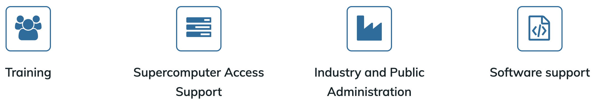

```{instructor-note}
   - 10 min teaching
   - 5 min discussion
```   

# Training providers

Many training providers offer free hands-on technical workshops to help researchers, engineers, and data scientists enhance their skills and productivity. This page highlights three projects that share a common teaching approach, covering topics from beginner-level programming to advanced HPC for experts.

## The Carpentries

```{figure} img/TheCarpentries.png
:width: 60%
```

[The Carpentries](https://carpentries.org/) is an international project that comprises [Software Carpentry](https://software-carpentry.org/) and [Data Carpentry](https://datacarpentry.org/), 
communities of instructors, trainers, maintainers, helpers, and supporters who share a mission to 
teach foundational computational and data science skills to researchers. The Carpentries teach 
foundational coding and data science skills to researchers worldwide.

### Carpentry instructor training

ENCCS instructors are encouraged to complete the
[Carpentry instructor training workshop](https://carpentries.github.io/instructor-training/), which
[anyone can apply for](https://carpentries.org/become-instructor/).

This instructor training lesson presents several concepts and methods from the Carpentries 
approach to teaching and highlight parts that are most important for teaching ENCCS style lessons.
We encourage you to further study the Carpentry lesson later and to sign up for a 2-day Carpentry
intructor training workshop.

### Carpentries audience

The Carpentries aims to teach computational **competence** to learners through an applied approach, avoiding the theoretical and general in favor of the practical and specific.
**Learners do not need to have any prior experience in programming.**  One major goal of a Carpentry workshop is to raise awareness on the tools researchers can learn/use to speed up their research.

By showing learners how to solve specific problems with specific tools and providing hands-on practice, learners develops confidence for future learning.

> ## Novices
> Carpentry learners can be qualified as **novices**: they do not know what they need to learn yet. A typical example is the usage of version control: the Carpentry `git` lesson aims to give a very high level conceptual overview of Git but it does not explain how it can be used in research projects.
{: .callout}


### Available lessons

- [The Unix Shell](https://swcarpentry.github.io/shell-novice/)
- [Version Control with Git](https://swcarpentry.github.io/git-novice/)
- [Programming with Python](https://swcarpentry.github.io/python-novice-inflammation/)
- [Plotting and Programming with Python](https://swcarpentry.github.io/python-novice-gapminder/)
- [Programming with R](https://swcarpentry.github.io/r-novice-inflammation/)
- [R for Reproducible Scientific Analysis](https://swcarpentry.github.io/r-novice-gapminder/)
- [Additional lessons](https://software-carpentry.org/lessons/)

### HPC Carpentry

HPC Carpentry teaches HPC-oriented coding and data science skills to researchers and aims to bring High Performance Computing under the Carpentries umbrella. HPC Carpentry is a set of teaching materials designed to help new users take advantage of high-performance computing systems. No prior computational experience is required - these lessons are ideal for either an in-person workshop or independent study.

**Available lessons**:

- [Introduction to High-Performance Computing](https://carpentries-incubator.github.io/hpc-intro/)
- [HPC Workflow Management with Snakemake](https://carpentries-incubator.github.io/hpc-workflows/)
- [HPC Workflow Management with Maestro](https://carpentries-incubator.github.io/HPC-workflow-lesson-maestro/)

### Data Carpentry

[Data Carpentry](https://datacarpentry.org/) develops and teaches workshops on the fundamental data skills needed to conduct research with the mission to provide researchers with high-quality, domain-specific training covering the full lifecycle of data-driven research. Data Carpentry workshops are domain-specific, teaching researchers the skills most relevant to their domain and using examples from their type of work.

- [Data Carpentry lessons](https://datacarpentry.org/lessons/)


---

## CodeRefinery

```{figure} img/logo-color-3d-cropped.png
:width: 40%
```

[CodeRefinery](https://coderefinery.org/) is a [Nordic e-Infrastructure Collaboration (NeIC)](https://neic.no/) project that started in October 2016.
The main goals of CodeRefinery are:
- Develop and maintain training material on software best practices for researchers that already write code. The CodeRefinery lessons address all academic disciplines and try to be as programming language-independent as possible.
- Provide a [code repository hosting service](https://coderefinery.org/repository/) that is open and free for all researchers based in universities and research institutes from Nordic countries.
- Provide training opportunities in the Nordics using Carpentries and CodeRefinery training materials.
- Articulate and implement the CodeRefinery sustainability plan.

### CodeRefinery audience

CodeRefinery workshops differ from Carpentry workshops as the audience is assumed to already write code and scripts and we aim at teaching them **best software practices**.

CodeRefinery learners usually do not have a good overview of **best software practices** but are aware of the need to learn them. Very often, they know the tools (Git, Jupyter, etc.) we are teaching but have difficulties to make the best use of them in their software development workflow.

> ## Competent practitioners
> CodeRefinery learners can be qualified as **competent practitioners** because they already have an understanding of their needs.
> *Novices* and *competent practitioners* will be more clearly defined in a {doc}`later section <learners>`.
{: .callout}

### Available lessons

- [Introduction to version control](https://coderefinery.github.io/git-intro/)
- [Collaborative distributed version control](https://coderefinery.github.io/git-collaborative/)
- [Reproducible research - Preparing code to be usable by you and others in the future](https://coderefinery.github.io/reproducible-research/)
- [Social coding and open software](https://coderefinery.github.io/social-coding/)
- [How to document your research software](https://coderefinery.github.io/documentation/)
- [Jupyter notebooks](https://coderefinery.github.io/jupyter/)
- [Automated testing - Preventing yourself and others from breaking your functioning code](https://coderefinery.github.io/testing/)
- [Modular code development - Making reusing parts of your code easier](https://coderefinery.github.io/modular-type-along/)
- [Other lessons](https://coderefinery.org/lessons/)

Many CodeRefinery contributors work at HPC centres, and several lessons on HPC have been developed:

- [Real-life compute cluster workflows](https://coderefinery.github.io/TTT4HPC_resource_management/)
- [Containers on HPC with Apptainer](https://coderefinery.github.io/hpc-containers/)
- [Parallelization and workflows](https://coderefinery.github.io/TTT4HPC_parallel_workflows/)

---

## ENCCS

```{figure} img/ENCCS_Logo_Horizontal_Colour.png
:width: 40%
```

[ENCCS](https://enccs.se/) (EuroCC National Competence Center Sweden) is one of 33 
nodes of the [EuroCC project](https://www.eurocc-access.eu/), which is funded by the 
European High-Performance Computing Joint Undertaking (EuroHPC-JU). As an NCC, we act as the central point of contact for HPC and related technologies in Sweden.
Our mission is to empower Swedish industry, academia and the public sector to leverage HPC, AI, and HPDA efficiently and effectively. 



Training is one of the main pillars of ENCCS' activities. We have developed a large amount of 
public and open source [lesson material](https://enccs.se/lessons/) and have organised, taught or contributed to over 60 
online workshops since September 2020. 
Our training philosophy and methods are to a large extent derived from two well established 
educational initiatives: [CodeRefinery](https://coderefinery.org/) and [The Carpentries](https://carpentries.org/). The material presented here covers both pedagogical ideas and practical 
aspects which underpin the development of lesson material, organisation of online or in-person 
workshops and the teaching itself.


### ENCCS audience

Similarly to CodeRefinery, ENCCS primarily targets **competent practitioners** in training workshops: participants are assumed 
to know what their needs are. Typically, their needs are to learn a technique or method to adapt 
their code to HPC, to learn novel programming languages or frameworks, or to deepen their knowledge 
of machine learning methods.

### Available lessons

> **For full overview, see [ENCCS lessons](http://enccs.se/lessons/)**.

**GPU programming**

- [OpenMP for GPU Offloading](https://enccs.github.io/openmp-gpu/miniapp/)
- [OpenACC](https://enccs.github.io/openacc/)
- [Intermediate CUDA](https://enccs.github.io/cuda/)
- [SYCL](https://enccs.github.io/sycl-workshop/)
- [GPU Programming: Why, When and How](https://enccs.github.io/gpu-programming/)
- [Developing Applications with the AMD ROCm Ecosystem](https://enccs.github.io/amd-rocm-development/)

**General HPC**

- [Intermediate MPI](https://enccs.github.io/intermediate-mpi/)

**Programming languages**

- [High-performance Data Analytics with Python](https://enccs.github.io/hpda-python/)
- [Julia for High Performance Scientific Computing](https://enccs.github.io/julia-for-hpc/)
- [Julia for High Performance Data analytics](https://enccs.github.io/julia-for-hpda/)

**AI/ML**

- [Graph Neural Networks and Transformer](https://enccs.github.io/gnn-transformers/)

**Applications**

- [Gromacs GPU Performance](https://enccs.github.io/gromacs-gpu-performance/)
- [VeloxChem: Quantum chemistry from laptop to HPC](https://enccs.github.io/veloxchem-workshop/)
- [TREX: Targeting chemical accuracy with quantum Monte Carlo on LUMI](https://trex-coe.github.io/school-ncc-2023/index.html)
- [MAX: Efficient materials modelling](https://enccs.github.io/efficient-materials-modelling-on-hpc/)
- [VASP best practices](https://enccs.github.io/vasp-best-practices/)
- [OpenFOAM](https://enccs.github.io/openfoam/)

**Tools**

- [CMake](https://enccs.github.io/cmake-workshop/)

**Quantum computing**

- [Introduction to Quantum Computing and hybrid HPC-QC systems](https://enccs.github.io/nordiquest-workshop/)

---

## CSC - IT Center for Science, Finland

```{figure} img/CSC.png
:width: 20%
```

[CSC- IT Center for Science](https://csc.fi/) is one of 33 nodes of the EuroCC project, which is funded by the European High-Performance Computing Joint Undertaking (EuroHPC-JU).
As a National Competence Center (NCC), we act as the central point of contact for HPC and related technologies in Finland.
Our mission is to empower Finnish industry, academia and the public sector to leverage HPC, AI, and HPDA efficiently and effectively. 

CSC’s training provides assistance and advice in using competitive resources for leading edge research. Our trainings are suitable beginners as well as advanced users and are lead by our top experts variously online and onsite. CSC training activities are centered around the services offered for research and industry: Super- , cloud- and quantum computing, data storage and sharing, working with sensitive data and software as well as domain specific trainings. 
We also provide specific training for LUMI supercomputer.

CSC audience: Researchers, students and data support personnel and anyone wanting to use CSC computing and data resources more efficiently in their work.

### CSC training offerings

Please check the [CSC training calendar](https://csc.fi/en/trainings/training-calendar/) for information on upcoming training. Note that only a few courses currently have training materials publicly available. 

**AI and Data Analytics**

Courses in AI, Machine Learning and Data Analytics, covering both theory and hands-on approaches:
- Data Analysis with R
- High Performance R
- Fundamentals of Machine Learning
- Practical Deep Learning

**Bioinformatics and Life Sciences**

Bioinformatics and life science  needs of scientists is quite diverse and thus courses helping them deploy their tools, analyse and store data plays a crucial role in enabling  high quality bioscience research. These diverse needs  include sensitive data handling and high-throughput computing of growing volumes of biological data:
- Containers and workflows in Bioinformatics
- Single-cell RNA-seq data analysis using Chipster

We also organise/coordinate some external events/trainings:
- ELIXIR /BioExcel events (webinars)
- Microbiome analysis course 

**Chemistry**

Courses tackling various themes of computational chemistry from the level of single atoms and molecules to large biomolecular systems such as proteins and membranes. These courses equip you with tools and methods to study chemical systems efficiently on modern supercomputers:
- CSC Spring School on Computational Chemistry
- Advanced GROMACS workshop
- Schrödinger Maestro workshop

**Cloud Computing**

Courses that range from entry level introduction to more advanced and specific topics. Entry level courses that require no previous experience with the tools (OpenStack and OpenShift) that prepare the student to be an independent user of the platforms. The more advance courses are perfect for diving into the complexities of the tool in a easy to follow manner:
- CSC Pouta Cloud Course
- Container clouds fundamentals (with CSC Rahti OpenShift OKD)
- How to run containers in Linux
- How to make container images with CSC Rahti?

**Data Management**

Encompasses a wide range of training to equip individuals with the skills and best practices needed to effectively collect, store, organize, share and utilize data. Participants learn about various data management services, tools and technologies and best practices for ensuring data integrity and potentially make their data available and usable by others:
- How to use the CSC Allas Storage Service?
- Key steps in data and software licensing: towards reusability
- Webinar: Services for Research 

**Fundamentals**

Courses covering the fundamentals of using CSC services and getting started with a topic.  These courses are meant to be a starting point for efficient use of relevant CSC services:
- [Using CSC environment efficiently](https://csc-training.github.io/csc-env-eff/)
- Introduction to CSC cloud services
- Fundamentals of Machine Learning  

**Geoinformatics**

Geoinformatics courses are meant for researchers working with spatial data, mainly with the goal to use supercomputers for spatial analysis: 
- [Geocomputing on the Supercomputer](https://csc-training.github.io/geocomputing_course/)
- Geospatial data analysis with Python/R
- Geospatial Machine Learning

**High Performance Computing**

Courses teaching basic and advanced topics around the use of High Performance Computing (HPC) for research. The topics range from introductory level to in-depth special trainings:
- High Performance R
- CSC Summer School in HPC
- Geocomputing on the Supercomputer
- [Using CSC environment efficiently](https://csc-training.github.io/csc-env-eff/)
- GPU programming

**LUMI**

Trainings related to LUMI, one of the world's fastest supercomputers. Courses encompass a wide range of topics from how to use the LUMI programming environment to more domain-specific trainings such as running specific software efficiently on LUMI's powerful GPU and CPU resources:
- GPU programming

**Programming**

Trainings related to the use of a certain programming language in our computing environment, e.g. for High Performance Computing:
- High performance R
- GPU programming
- Performance Optimization
- Julia

**Quantum Computing**

Our courses offer a comprehensive introduction to the cutting-edge field of quantum computing, suitable for individuals from all backgrounds. Participants will learn the core concepts of quantum computing and gain practical experience in writing quantum programs using the most popular quantum programming tools. Additionally, they will have the opportunity to work with real quantum computers available in the Finnish quantum computing ecosystem(FiQCI):
- Introduction to Quantum Computing and FiQCI
- Quantum Computing with PennyLane on LUMI

---

## Recommended external resources

The lessons above do not cover all relevant topics in HPC, HPDA and AI, but 
ENCCS also maintains a list of recommended public training material which you 
can find at [https://enccs.se/external-training-resources/](https://enccs.se/external-training-resources/).

```{challenge} Contribute to the list of external training resources 
**For after this workshop:**  
If you know of other good public training material, or if you have developed own material 
that you would like to share with the world, please [get in touch](https://enccs.se/contact/) or 
[open an issue](https://github.com/ENCCS/instructor-training/issues) on this repository!
```

